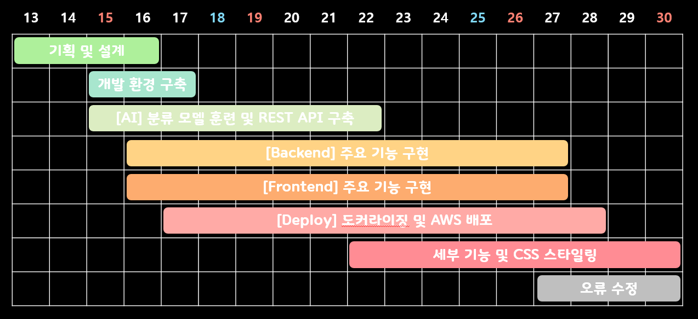
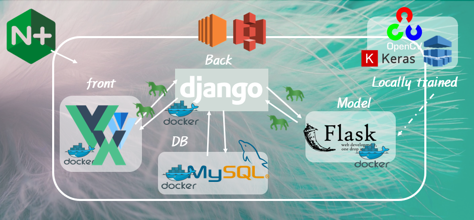
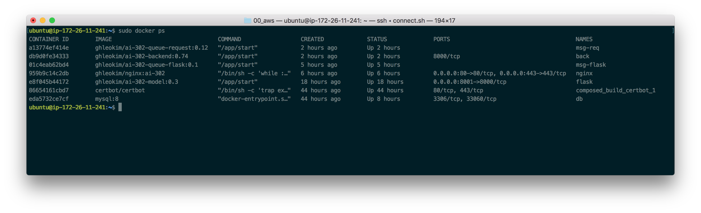
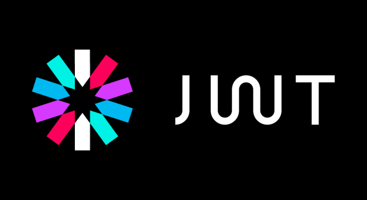
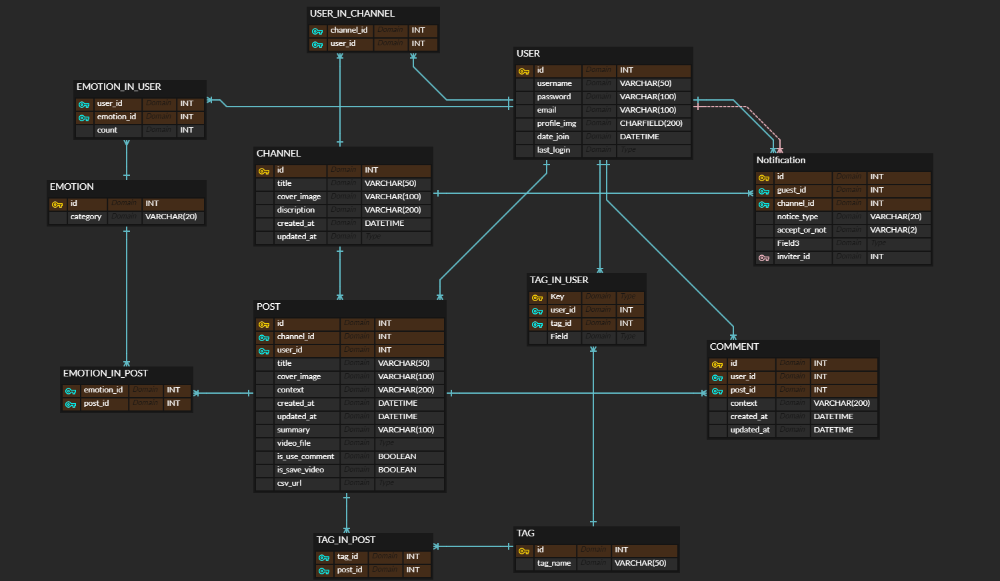
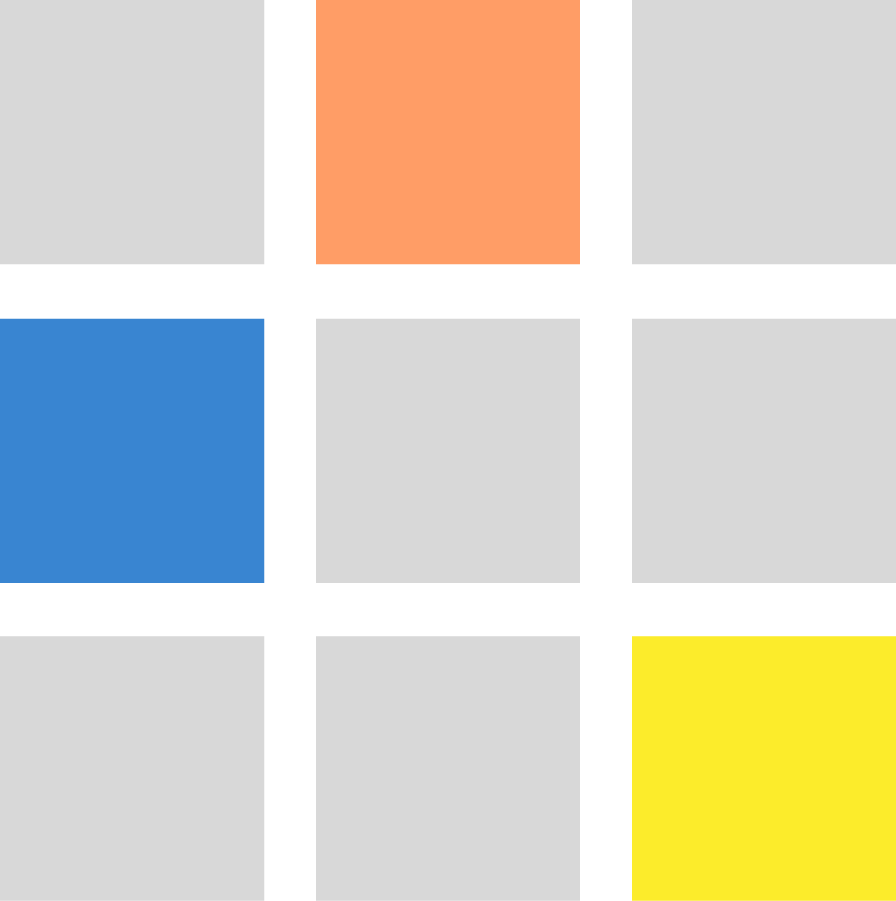

# README


## 개발 동기

- **사회적 거리두기의 시작**

  이에 사람들은 혼자있는 시간이 길어지며 생각할 시간도 많아지게 되었습니다. 그리고 그러한 솔직한 생각을 정리하기에는 너무 오픈된 SNS보다는 조금은 폐쇄적인 공간이 필요합니다.

- **사회적 고립의 심화**

  집안에만 있는 기간이 길어지며 점점 우울감을 호소하는 사람들도 증가하고 있습니다. 우울증은 혼자 있을 때보다 다른 사람과 이야기를 나눌 때 그 증상이 완화됩니다.

이러한 배경 하에서 폐쇄적이지만 친밀한 사람들에게 편하고 쉽게 일상을 공유할 수 있는 공간을 만들고 싶었습니다.


## 서비스 소개

유저는 크게 두 가지 방향성을 가지고 저희 서비스를 이용할 수 있습니다. 

1. 나만의 일기장

   유저는 그 날 있었던 일에 대해 영상을 찍어 올립니다. 

   영상이 저장되면 모델에서는 크게 두 가지 분석을 진행하는데, 영상의 음성에 대해서는 api 요청을 통해 음성을 text화 시키고 해당 내용을 바탕으로 핵심 문장과 태그들을 뽑아냅니다. 영상의 이미지에 대해서는 사용자들의 얼굴 표정을 분석하여 총 7가지의 표정으로 분석하여 보여줍니다.

   사용자들은 자신이 쓴 일기에 대해 날짜로 검색을 하거나 태그로 검색을 할 수 있습니다.

   또한 사용자는 일기를 작성할 때 마다 해당 일의 commit 달력에 색을 채워 넣을 수 있게 됩니다.

2. 공유 일기장

   기본적인 기능은 나만의 일기장과 동일하나, 나만의 일기장에 공유 기능이 추가된 형태입니다.

   사용자는 자신의 친구를 검색하여 자신의 채널에 초대를 하고, 상대방이 그 초대에 응하면 같은 일기장에서 함께 일기를 작성할 수 있게 됩니다.

   일기를 공유하는 사용자들은 서로의 일기를 볼 수 있으며 해당 일기에 comment도 남길 수 있습니다.

저희는 이러한 서비스를 통해 사용자들의 마음을 깃털처럼 가볍게 만들고 마음을 치유하는 것이 목표입니다.


## 개발 일정




## 기술 스택 및 구조




### Model

1. 표정 분석 모델

   - 목적

     모델 파트의 개발 목적은 영상의 연속적인 프레임들에서 표정을 분석하는 표정 분류 모델을 훈련시키고 영상에서 음성을 추출해 텍스트로 변환시키고, 텍스트의 여러가지 요약 데이터를 만드는데 있었습니다.

   - 모델 구현의 어려움

     연속적인 이미지 프레임에서 표정을 분석하는 모델로 초기에는 cnn과 lstm로 이루어진 신경망을 중심으로 찾아보았는데, cnn으로만 이루어진 신경망에 비해  영상이라는 연속적인 데이터의 흐름 속에서 점진적인 표정의 변화를 고려하는 cnn과 lstm의 구조가 더 논리적이며 실제 연구들에서 더 낮은 오차율을 보였기 때문입니다. 그러나 감정의 카테고리나 정도가 라벨링 된 독백 영상 자료는 보다는 실험실 환경에서 통제된 데이터들이 많았고 그마저도 접근이 쉽지 않았습니다.

   - 결과

     결론적으로 mind-gitter 서비스에서 적용된 모델은 kaggle 2013 데이터로 학습된 cnn 신경망이며 단순 이미지 데이터에서 정확도는 약 50% 가까이였고 시각화 시킨 결과는 다음과 같습니다.

     

   - 결과 해석 & 의의

     이미지로 훈련시킨 모델로 영상을 분석할 경우 분석결과에서 감정의 연속성과 일관성을 확인할 수 있을 지 걱정하였는데, 의외로 가상의 영상 일기를 찍어 올렸을 때 이야기의 흐름에 따라 변화하는 섬세하게 감정을 잘 캐치하며 또한 일관성있게 유지하는 모습을 보였습니다.

       예를 들어, 오랜 친구와 싸워 처음에는 걱정하며 염려하다 후반에 다시 친구와 화해할 것을 다짐하는 영상의 경우, 처음에는 두려움과 슬픔이 두드러지게 나타나고 이후 슬픔이 주된 감정으로 약 40%에 이르는 확률로 일관 되게 이어지다 마지막 희망찬 부분에서는 80% 가 넘는 확률의 분포를 보였습니다.

      사용자에게 찍힌 영상의 매 순간의 감정을 분석한 결과의 피드백을 요청하기 어렵다고 판단해 모델의 업데이트는 계획하지 않아 계획하지 않았습니다.

 2. 개발 단계 

3. train

   - train에서는 사람의 얼굴로부터 7가지 카테고리의 표정을 학습합니다.
   - 데이터 전처리에서는 사진을 흑백으로 바꾸어 3차원의 데이터에서 2차원의 데이터로 변화시키고 기타 필요한 전처리 과정을 거칩니다.
     - 3차원의 얼굴 이미지 데이터로 학습을 시킬 때보다 2차원의 얼굴 이미지 데이터의 경우 더 높은 정확도를 보인다고합니다.
   - 신경망의 구조는 `Model > modles > simple_cnn.py` 에서 확인할 수 있습니다.
   - 모델을 검증하기 위해 `validation`과 `test` 외에도 여러 시각화를 거쳤는데 `confusion matrix` 와 `classification_report`등의 함수를 호출하였습니다. `test.py와 data> visualization.py`에서 확인할 수 있습니다.

4. test

- test 단계에서는 실제 영상 자료에서 프레임을 추출해 모델을 통해 표정을 분석하고, 텍스트 분석을 위해 음성을 추출하는 등의 작업을 거쳤습니다.
- `data > [preprocess.py](http://preprocess.py)` 에서는 `ffmpeg`를 통해 입력된 영상을 전처리합니다.
- 얼굴을 인식하는 모델은 `openCV.dnn` 의 `resNet`기반의 `ssd` 입니다. yolo에 비해 효율성과 정확도 면에서 더 나은 성능을 보인다고 합니다.
- 추출된 얼굴은 표정분류모델에 전달됩니다. 라벨링이 없는 자료를 실제 서비스에서 가정하기 때문에 `validation` 은 고려하지 않습니다.

3. flask rest api

- 표정 분류 모델을 백에서 돌리기엔 백서버가 부담이 크기 때문에 따로 예측을 위한 모델 서버를 구축하기로 결정하였습니다.
- 이를 위해 필요한 데이터를 입력받고 처리된 결과만을 제공하는 간단한 수준의 rest API 로 만들기로 하고 마이크로웹프레임워크의 flask를 사용해 구축하였습니다.
- 아마존의 AI모델의 flask api 예시를 참고하였고, 하나의 ec2에 여러 서버가 빌드되어야하기 때문에 편의와 일관성을 위해 도커 이미지로 빌드하고 이후 ec2에 도커 이미지를 빌드합니다. 이때 여러 서버로 요청을 연결해주는 nginx설정과 flask api 서버의 연결을 연결해주는 gunicorn등의 설정부터 배포까지는 devOps를 맡은 김건호가 맡아 처리하였습니다.

4. STT api 요청 및 텍스트 요약

- 영상에서 추출된 음성을 텍스트화하기 위해 자체적인 모델을 구축할 수 도 있지만 주어진 시간내에 구축하기엔 무리라 상용 STT api 를 활용하기로 했습니다.
- 전반적으로 aws를 이미 사용하고 있었고 성능과 편의에 있어서 좋았기 때문에 aws transcribe를 사용하였습니다.
- 텍스트 요약에 있어서는 초기 구글의 검색 엔진인 page rank를 기반으로한 text rank알고리즘을 활용하였는데, 전체 적으로 다른 문장들과의 관계성이 제일 높은 문장과 태그들을 추출해 유저에게 제공합니다.

5. docker image build

- conda 환경에서 작업하였기 때문에 conda export 명령문으로 환경 파일을 빌드할 수 있게 합니다.
- conda image에서 빌드를 시작하며 필요한 ffmpeg, jdk, knolpy등을 설치합니다
- 건호를 부릅니다.

- 

### Docker, Docker Compose



프론트엔드, 백엔드, DB, 모델까지 전부 컨테이너화하여 관리하였습니다. 도커와 도커 컴포즈를 활용함으로써 각기 다른 환경에서 돌아가는 서비스를 효율적으로 관리할 수 있었고, 아래와 같은 장점을 얻었습니다.

1. 복잡한 환경 변수를 보기 쉽게 정리할 수 있었습니다.
2. 서버 배포 중 런타임 버전, 라이브러리 등 의존성 문제로 인해 생기는 오류를 미연에 방지할 수 있었습니다.
3. 적절한 포트 및 네트워크 구성으로 포트 노출을 없애고 Nginx 컨테이너에서 리버스 프록시 호출을 통해 각 서비스에 접근할 수 있었습니다.

또한 이외에도 기본적인 보안과 안정성에 신경을 쓰고자 했습니다.

Let's Encrypt, Certbot을 통해 SSL 인증서를 관리하고 이를 일정 주기로 갱신하도록 설정하였습니다.

볼륨 바인딩을 통해 컨테이너가 종료되어도 필요한 설정, 데이터 등이 사라지지 않도록 했습니다.

마지막으로 Flask와 파일 시스템을 이용하여 간단한 메시지 큐 서버를 구축하였고, 모델 inference 과정에서 생기는 백엔드 서버의 지연 시간을 최소화했습니다.

### Django

- **JWT - 로그인 세션**

  회원 인증과 세션관리의 편리함을 위하여 JWT를 이용한 로그인/회원가입 기능을 구현하였습니다. JWT를 이용하여 REST 서비스로 제공이 가능하였고, 중앙 집중식 인증 서버와 데이터베이스에 의존하지 않는 쉬운 인증 및 인가 방법을 제공하였습니다.



- **REST API**
  1. Django rest api framework를 이용하여 REST API URL을 구축하고, 이에 따른 Response를 적절히 주기 위해 Serializer를 구현하였습니다. 크게 Account 관련, Channel 관련, Post 관련 API를 나눠서 정리하였고, 이에 알맞게 `GET, POST, PUT, DELETE method`에 따라 `조회 / 생성 / 변경 / 삭제`의 기능을 구현하였습니다.
  2. Model의 영상 분석 처리에 소요되는 시간이 긴 점을 고려하여 Back Server-Model Server 간의 API를 만들어 `비동기 큐 로직`을 구현하였습니다. Front의 요청을 받아 이를 Model에 전달하는 API와, Model의 결과를 담은 요청을 받아 DB에 저장하는 API로 이를 연결하였습니다.

- **MySQL - DB 구축**
  1. Django의 Migration 기능과 MySQL을 이용하여 사이트의 데이터베이스를 구축하였습니다.
  2. Image, Video 등의 File Data는 AWS S3에 직접 저장한 후, 그 URL을 Front에서 받아 DB의 text field에 저장하여 관리하였습니다.




## Vue.js

프론트 엔드는 백엔드 서버와의 통신으로 데이터를 얻어 사용자에게 보다 효과적으로 보여주기 위해 크게 Vuetify와 Vuex를 사용하여 개발을 진행하였습니다. 

그리고 유저, 포스트, 다이얼로그, 코멘트 등 백엔드 서버와의 통신이 많아 Vue의 라이프사이클을 확실히 이해하고 적용시키는데 노력을 기울였습니다. 

개발 단계는 레이아웃 설계, 기능 구현, CSS 스타일링으로 진행하였고, 개발하는 기능별로 Git Branch를 달리하여 발생할 수 있는 Conflict를 방지하였습니다.

초기에 컴포넌트화를 시켜 개발을 진행하였으나, 개발 일정이 촉박해짐에 따라 컴포넌트를 잘 분리하지 못해 아쉬움이 남습니다.

- **Vuetify**

Vuetify를 사용하여 사용자에게 최상의 UI 경험을 제공하기 위해 노력하였습니다. Vuetify의 UI 컴포넌트와 기존의 HTML 태그를 혼용하게 되면서 그리드 시스템을 벗어나는 경우가 발생하였고, 이를 해결하기 위해 CSS style 태그를 적극적으로 활용하여 사용자의 UI/UX 경험을 개선시켰습니다.

- **Vuex**

또한 Vuex를 사용하여 어플리케이션의 상태 관리를 용이하게 하였고, 모듈을 크게 auth 와 diary로 구분하였습니다. 유저와 관련된 상태들은 모두 auth에서 관리를 하였고, 일기와 관련된 상태들은 모두 diary에서 관리하였습니다.

이렇게 관리된 state들은 각각 필요한 컴포넌트들에서 적절히 사용되었고, 반복적으로 사용되는 함수들을 Vuex를 통해 모듈화 하여 프로젝트의  완성도를 한 층 높일 수 있었습니다.

- 주요 코드

```jsx
# vuex > diary.js

async bringDiaryDetail({ commit }, diaryPK) {
    const token = sessionStorage.getItem("jwt");
    const options = {
      headers: {
        Authorization: "JWT " + token
      }
    };
    const message = await axios.get(`${HOST}/posts/${diaryPK}/`, options);
    commit("setSelectedDiary", message.data);
    const mess = await axios.get(
      `${HOST}/user/${message.data.user_id}/`,
      options
    );
```

- 세션 스토리지에 저장된 Token을 이용하여 백 api로 요청을 보내 받아온 다이어리에 대한 데이터를 state에 저장합니다.
- 또한, 받아온 데이터를 가공하여 해당 다이어리의 user에 대한 추가 정보를 다시 요청하고 있습니다.


## 배포 URL

**https://mind-gitter.me**

**테스트 아이디**: mind_gitter / **비밀번호**: qpwoeiru


## 로고




