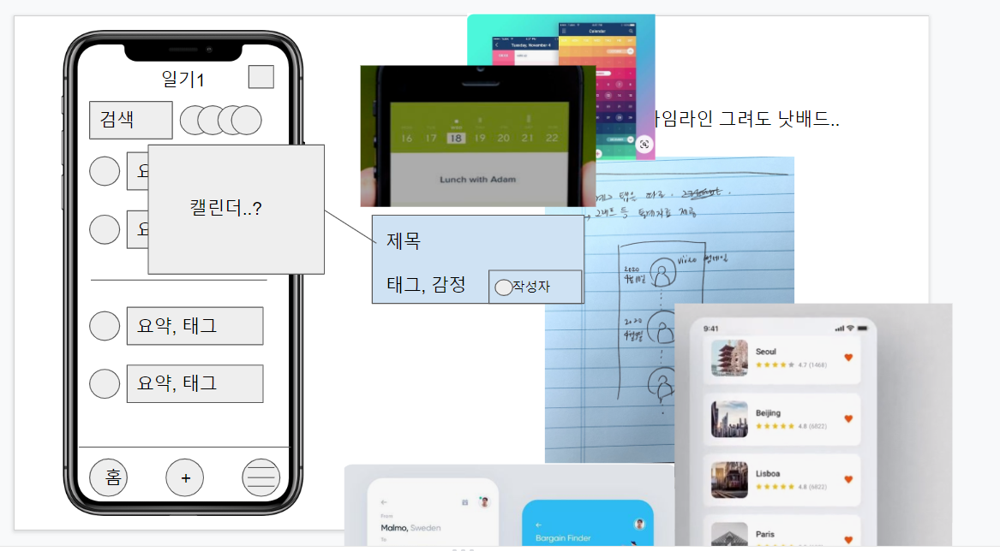
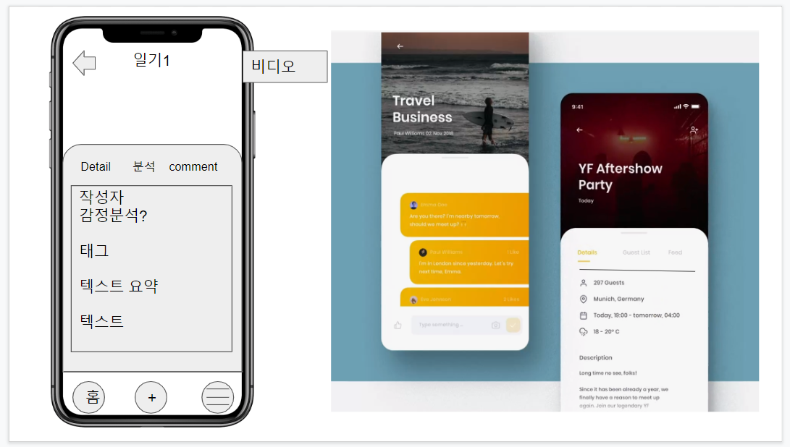
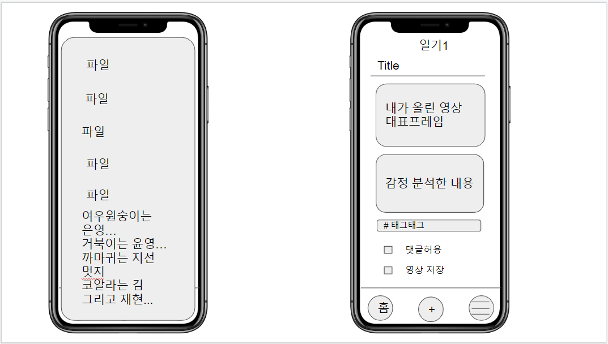
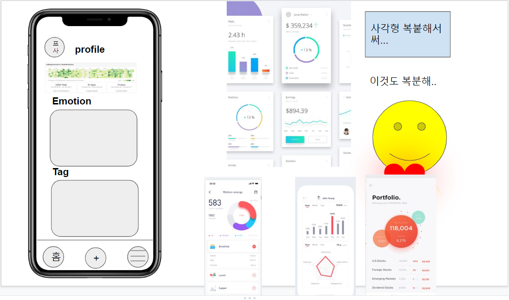

# 기획안

## 팀 구성원

- 팀명: A302
- 팀원: 김건호, 김민지, 김재현, 김은영, 이지선, 정윤영

## 데이터셋 검색 및 선정

- 얼굴 표정 - 감정

## 팀만의 서비스 기획

- 우리팀의 서비스를 설명할 수 있는 하나의 문장

  - 영상 표정 분석을 통한 감정일기(개인적 공간)
  - 폐쇄적 기능이 기본 (선택적 공개)

- 타겟

  - 일기를 편하게 쓰면서 감정 분석을 받고 싶은 사람
  - 동굴이 필요한 사람

- 프로젝트 형태

  - 모바일 제작

- 데이터셋

  - 얼굴 표정 - 감정

- 모델

  - 

- 사용자의 서비스 이용 동선

  https://docs.google.com/presentation/d/1ffcF7FXZSad7k5uWkm-JtjzBLMuxebCJI4qKTavmFK4/edit#slide=id.p

  

  

  

  

  

- 기술 스택

  - 프론트: Vue
  - 백: Django
  - 데브옵스: docker
  - DB: mysql

- 특징

  - 기존의 sns에 지친 사람들에게 본인의 비밀 일기장같은 공간이 될 수 있을 것
  - 연인들이나 친한 친구들 사이의 교환일기장

## 개발 일정 수립

- 역할 분배
  - 프론트
    - 김재현, 이지선
  - 백
    - 김민지, 김은영, 정윤영
  - 데브옵스
    - 김건호
- 개인 일정 및 통합 일정
  - 4주차
    - 와이어프레임 & 기본 기능(로그인&회원가입) 구현 & AI 모델 구현
  - 5주차
    - 성능 개선 및 디버깅 & 디자인개선 (+알파)
  - 6주차
    - 발표준비 & UCC

